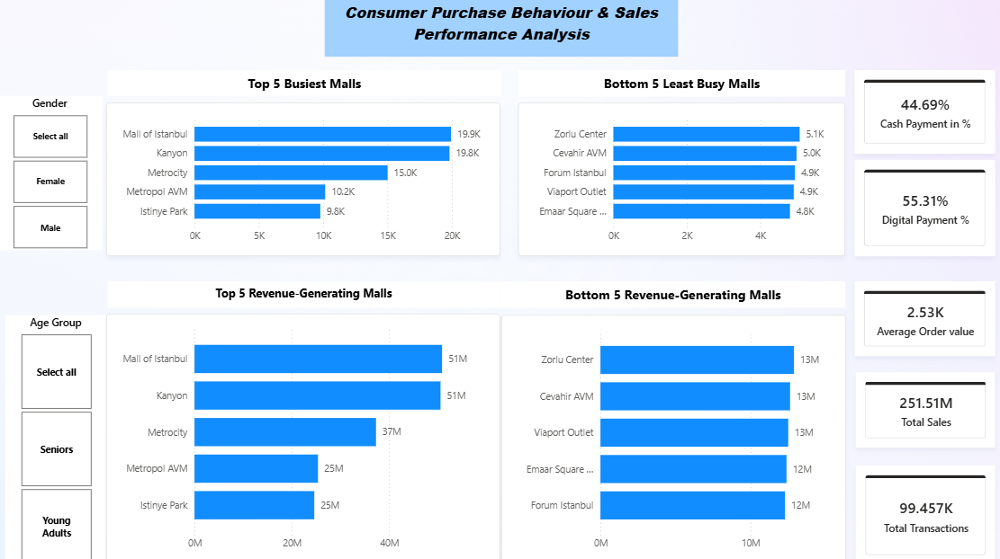
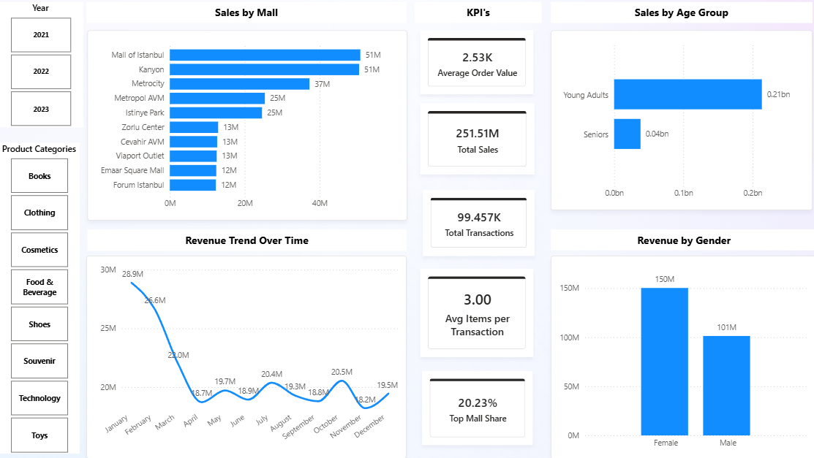

# Consumer Purchase Behaviour & Sales Performance Analysis Dashboard

## Project Overview
This project is an interactive Power BI dashboard designed to analyse retail consumer purchasing behaviour, shopping mall performance, payment preferences, and revenue trends.

The objective of this project is to transform retail transaction data into actionable business insights that support data-driven decision-making in sales performance evaluation, customer segmentation, payment behaviour analysis, and mall performance monitoring.

---

## Business Objectives
This dashboard answers key business questions such as:

- Which shopping malls generate the highest and lowest sales revenue?
- Which malls have the highest and lowest customer transaction traffic?
- What payment methods are preferred by customers?
- Which customer demographics contribute the most revenue?
- How does revenue change over time?
- What percentage of total revenue comes from the top-performing mall?
- What is the average spending behaviour of customers?

---

## Dashboard Pages

### 1. Mall Performance Dashboard
This executive-level dashboard provides a quick overview of overall mall performance.

**Features:**
- Top 5 Busiest Malls (By Transactions)
- Bottom 5 Least Busy Malls
- Top 5 Revenue-Generating Malls
- Bottom 5 Revenue-Generating Malls
- Cash Payment Percentage
- Digital Payment Percentage
- Average Order Value
- Total Sales
- Total Transactions

**Interactive Filters:**
- Gender
- Age Group

---

### 2. Sales Analysis Dashboard
This analytical dashboard focuses on customer purchasing behaviour and revenue trends.

**Features:**
- Sales by Mall
- Sales by Age Group
- Revenue Trend Over Time
- Revenue by Gender
- Average Items per Transaction
- Top Mall Revenue Share
- Total Sales
- Total Transactions
- Average Order Value

**Interactive Filters:**
- Year
- Product Categories

---

## Key Performance Indicators (KPIs)
The dashboard includes the following business KPIs:

- Total Sales Revenue
- Total Transactions
- Average Order Value (AOV)
- Average Items per Transaction
- Cash Payment %
- Digital Payment %
- Top Mall Revenue Share %

---

## Key Business Insights
Key findings from the analysis:

- Mall of Istanbul and Kanyon are the strongest performing malls in terms of both revenue and transaction volume.
- Young adult customers contribute the largest share of overall revenue.
- Female customers generate higher total revenue than male customers.
- Digital payments are more frequently used than cash payments.
- Revenue shows seasonal variation, with January being the strongest sales month.
- The top-performing mall contributes over 20% of total revenue, indicating strong revenue concentration.

---

## Tools & Technologies Used
- Power BI
- DAX (Data Analysis Expressions)
- Data Modeling
- Data Cleaning & Transformation
- Business Intelligence Dashboard Design

---

## Skills Demonstrated
This project demonstrates practical skills in:

- Business Intelligence Reporting
- KPI Development
- DAX Measure Creation
- Interactive Dashboard Design
- Data Visualisation
- Customer Behaviour Analysis
- Sales Performance Analysis
- Retail Analytics
- Data Storytelling

---

## Dataset Information
The dataset contains retail transaction records with the following attributes:

- Customer ID
- Gender
- Age
- Product Category
- Quantity Purchased
- Product Price
- Payment Method
- Invoice Date
- Shopping Mall
- Sales Revenue

---

## Repository Structure
```text
Retail-Sales-PowerBI-Dashboard/
│
├── Retail_Sales_Dashboard.pbix
├── dashboard_page1.png
├── dashboard_page2.png
├── dataset.csv
└── README.md
```

---

## Dashboard Preview
Add dashboard screenshots here after uploading:

```markdown



```

---

## Conclusion
This project demonstrates how Power BI can transform raw retail transaction data into meaningful business intelligence that supports strategic decision-making.

It highlights practical use of DAX, KPI development, dashboard storytelling, and interactive business analytics for retail performance evaluation.
